<p align="center">
  <picture>
    <source media="(prefers-color-scheme: dark)" srcset=".github/assets/banner.svg">
    
  </picture>
</p>

# With Love, Math _(With-Love-Math)_

[](LICENSE)
[](plugin.json)
[](https://agent-plugins.org/specification)
[](https://github.com/richardlitt/standard-readme)
[](#the-invariant-wonder)

An [Agent Plugins 1.0.0](https://agent-plugins.org/specification) plugin that turns deliberation into a verdict. You give it a decision or an existing project; it runs the decision through a fixed rubric — four principles, one loop, one invariant — and returns **Aligned** or **Needs Revision**, naming exactly which principle failed and the single first move to fix it.

<p align="center">
  <picture>
    <source media="(prefers-color-scheme: dark)" srcset=".github/assets/pillars.svg">
    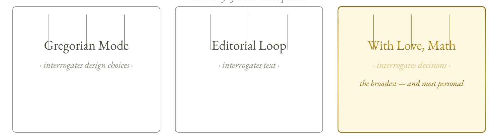
  </picture>
</p>

The plugin *is* the framework. It applies its own principles to itself: R1 by always returning to Why, R2 by checking every decision against the invariant, R3 by keeping each principle distinct yet unified, R4 by working at any scale — one decision or a whole project.

> [!IMPORTANT]
> **It is not a cover generator, not a website builder, and not a chat partner for endless deliberation.** It is a discipline for running a decision and getting a verdict — a binary **Aligned / Needs Revision** naming any failing principle.

**How to read this page.** The README is built as seven numbered plates on one continuous ground. Every plate carries a ribbon icon, every chapter is numbered, and the invariant — **WONDER** — recurs as a visual anchor. Land anywhere: the plate number and icon tell you where you are, and [the verdict table](#the-verdict-table) is never more than one click away in the [contents](#contents).

<p align="center">
  <picture>
    <source media="(prefers-color-scheme: dark)" srcset=".github/assets/divider.svg">
    
  </picture>
</p>

<a name="plate-00" id="plate-00"></a>
<p align="center">
  <picture>
    <source media="(prefers-color-scheme: dark)" srcset=".github/assets/plate-00.svg">
    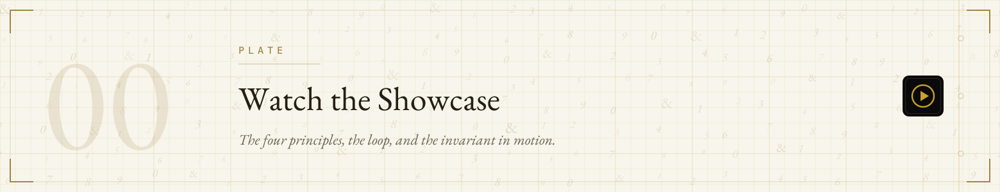
  </picture>
</p>

https://github.com/user-attachments/assets/95a86047-7f20-4f94-b625-53c041392bc1

*The 64-second showcase — the four principles, the loop, and the invariant in motion. Direct download: <a href="https://github.com/AlastairZeved/With-Love-Math/releases/download/showcase/with-love-math-showcase.mp4">MP4 (16.7 MB, release asset)</a>.*

## Contents

<a name="contents" id="contents"></a>

| | | |
|---|---|---|
| [**Plate 00 — Watch the showcase**](#plate-00) · *1 min* | [**Plate 01 — Background**](#plate-01) | [**Plate 02 — Install**](#plate-02) |
| [**Plate 03 — Usage**](#plate-03) — commands · example · output | [**Plate 04 — The Framework**](#plate-04) — principles · loop · map · layers · WONDER | [**Plate 05 — Architecture**](#plate-05) — packaging · skills · subagents · hooks |
| [**Plate 06 — Colophon**](#plate-06) — maintainers · contributing · license | | |

<a name="the-verdict-table" id="the-verdict-table"></a>

### The verdict table

The framework's output is binary at the top level. Every run of the decision engine, every audit, every check resolves to one of two verdicts — the same two words a reader can land on from anywhere on this page:

| Verdict | Mark | Meaning | Named by |
|---|---|---|---|
| **Aligned**  | | The decision holds: the loop was run, the principles pass, the invariant is preserved. | — |
| **Needs Revision**  | | The decision does not yet hold — and the framework names the failing principle(s) and the single first move. | R1 / R2 / R3 / R4 by name |

The verdict is never softened: a Fail is never rounded up to a Weak to reach Aligned. The [output format](#output-format) shows the exact shape.

<a name="plate-01" id="plate-01"></a>
<p align="center">
  <picture>
    <source media="(prefers-color-scheme: dark)" srcset=".github/assets/plate-01.svg">
    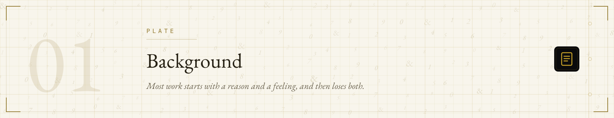
  </picture>
</p>

Most work starts with a reason and a feeling, and then loses both. Iterations accumulate, constraints arrive, other people's opinions land on top, and by the end the decision no longer resembles the one you set out to make.

<p align="center">
  <picture>
    <source media="(prefers-color-scheme: dark)" srcset=".github/assets/art-drift.svg">
    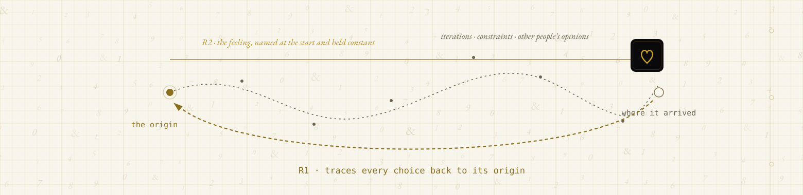
  </picture>
</p>

With Love, Math is a framework for not losing them: R1 traces every choice back to its origin; R2 names the feeling before you start and holds it constant through every change.

"Gregorian" is the term the author reuses from Gregorian Mode, where it was defined as *a standard strangers adopt and never stop running* — hence `gregorian-decision`, the name of the full-framework subagent. Here the standard is a four-principle decisioning framework whose single invariant is WONDER. The framework is meant to be passed on, not just used privately: the `/teach` command and `tutor` skill exist precisely so others can adopt and run it.

| The claim | What it means here |
|---|---|
| **Four depths, one object** | Every element of the framework reads at four depths simultaneously — Design Philosophy (physical), Self-Help / Self-Love (emotional), Math in Nature (structural), Esotericism (spiritual). A good decision holds at all four. This is the framework's most unusual claim: a layout decision, a life decision, a structural pattern, and a spiritual question are the same object viewed from different altitudes. |

Its brand personality is **Friendly · Quirky · Bold · Sophisticated** — warm enough to invite, strange enough to be memorable, confident enough to commit, refined enough to trust.

<a name="plate-02" id="plate-02"></a>
<p align="center">
  <picture>
    <source media="(prefers-color-scheme: dark)" srcset=".github/assets/plate-02.svg">
    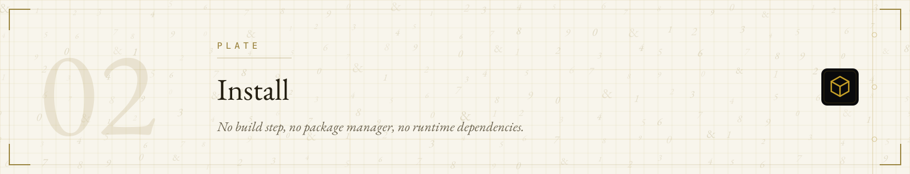
  </picture>
</p>

No build step, no package manager, no runtime dependencies — the plugin is plain markdown that a compatible agent discovers on load. Clone once; every install path below starts from that clone or reads the repository directly.

```bash
git clone https://github.com/AlastairZeved/With-Love-Math.git
```

The root [`plugin.json`](plugin.json) is the [Agent Plugins 1.0.0](https://agent-plugins.org/specification) manifest — the portable source of truth every conformant client reads. Client-specific adapters live in their own namespaces and are ignored by clients that do not implement them, which is what keeps the package portable.

### Dependencies

> [!NOTE]
> None. Markdown only. (Git, to clone the repository.)

### What loads where

| Agent | Install route | Skills | Commands | Subagents | Hooks |
|---|---|---|---|---|---|
| **Claude Code** | [`claude --plugin-dir`](#claude-code) |  |  5 |  3 |  2 |
| **Hermes Agent** | [`hermes plugins install`](#hermes-agent) |  4 | via skills | — | — |
| **Codex** (CLI / ChatGPT app) | [`/plugins` browser + marketplace](#codex) |  | — | — | — |
| **Cursor** | [Customize page or `~/.cursor/plugins/local`](#cursor) |  | \* | \* | — |
| **GitHub Copilot** | [`copilot plugin install` / VS Code](#github-copilot) |  |  5 |  3 | — |
| **Pi Agent** | [clone into `~/.pi/agent/skills/`](#pi-agent) |  4 | — | — | — |
| **Any SKILL.md agent** | [copy a `skills/` folder](#any-skillmd-agent) |  | — | — | — |

\* Cursor reads the Claude-namespace `commands/` and `agents/` through its [`.cursor-plugin/plugin.json`](.cursor-plugin/plugin.json) manifest where a Claude-style command or agent is understood.

In agents that register no slash commands, the same procedures are reachable in words — "Run the decision engine on `<decision>`" reaches the identical skill. The commands are doors, not the house.

### Per-agent instructions

Seven routes into the same repository — the install section is a hallway of doors, each card its own room:

<p align="center">
  <picture>
    <source media="(prefers-color-scheme: dark)" srcset=".github/assets/art-doors.svg">
    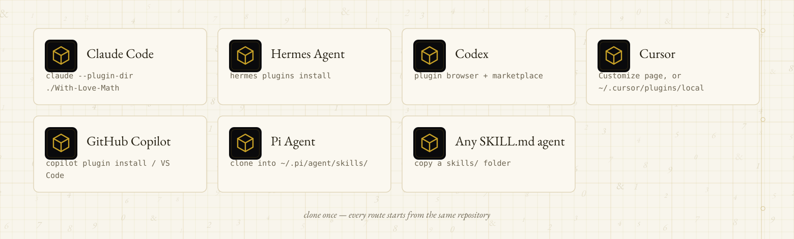
  </picture>
</p>

<a name="claude-code" id="claude-code"></a>
<details>
<summary><strong>Claude Code</strong> · <code>claude --plugin-dir ./With-Love-Math</code></summary>

Requires [Claude Code](https://code.claude.com/docs).

```bash
git clone https://github.com/AlastairZeved/With-Love-Math.git
claude --plugin-dir ./With-Love-Math
```

The `--plugin-dir` flag loads the plugin directly without marketplace installation. There is no `marketplace.json` in this repository, so `/plugin marketplace add AlastairZeved/With-Love-Math` will not work; `--plugin-dir` is the documented direct-load path.

The five commands, three subagents, and both hooks live under the [`com.anthropic.claude/`](com.anthropic.claude) client namespace, declared in [`.claude-plugin/plugin.json`](.claude-plugin/plugin.json). `claude plugin validate .` passes on this repository as shipped.

To install permanently, copy the plugin into your personal skills directory:

```bash
cp -r ./With-Love-Math ~/.claude/skills/with-love-math
```

Claude Code auto-discovers plugins in `~/.claude/skills/` that carry a `.claude-plugin/plugin.json` manifest, so it loads on the next session as `with-love-math@skills-dir`. Manage it afterward with `claude plugin disable with-love-math@skills-dir`, `claude plugin enable with-love-math@skills-dir`, or `rm -rf ~/.claude/skills/with-love-math` to uninstall.

</details>

<a name="hermes-agent" id="hermes-agent"></a>
<details>
<summary><strong>Hermes Agent</strong> · <code>hermes plugins install … --no-enable</code></summary>

```bash
hermes plugins install AlastairZeved/With-Love-Math --no-enable
hermes plugins enable with-love-math
hermes gateway restart
```

Portable Agent Plugins packages install disabled by default; enable explicitly and restart the gateway for the skills to take effect. The four portable skills are discovered from the root manifest; `hermes plugins validate <repo-dir>` and `hermes plugins show with-love-math` verify the install, and `hermes plugins remove with-love-math` removes it.

</details>

<a name="codex" id="codex"></a>
<details>
<summary><strong>Codex</strong> · CLI plugin browser or ChatGPT desktop app</summary>

Requires [Codex](https://developers.openai.com/codex). Codex reads the portable root [`plugin.json`](plugin.json) — which declares the Agent Plugins schema and carries OpenAI's presentation data under `extensions["com.openai"]` (display name "With Love, Math", category "decision-making").

OpenAI documents the `.codex-plugin/plugin.json` manifest as a supported compatibility fallback for existing `.codex-plugin/` packages.

In **Codex CLI**, open the plugin browser and install from a configured marketplace:

```text
/plugins
```

To make the plugin installable from this repository, add the repo as a marketplace source:

```bash
codex plugin marketplace add AlastairZeved/With-Love-Math
```

For **local testing**, OpenAI's packaging documentation routes local plugins through a marketplace file — either a repo-scoped `.agents/plugins/marketplace.json` (with the plugin folder under `$REPO_ROOT/plugins/`) or a personal one at `~/.agents/plugins/marketplace.json`.

Install from the marketplace in the CLI browser or the ChatGPT desktop app and start a new session. Bundled skills become available in the new session. The `.codex-plugin/plugin.json` fallback manifest ships for environments that expect the legacy layout.

The three subagents stay in the Claude namespace — Codex subagents use TOML definitions, which this repo does not ship.

</details>

<a name="cursor" id="cursor"></a>
<details>
<summary><strong>Cursor</strong> · Customize page or <code>~/.cursor/plugins/local</code></summary>

Requires [Cursor](https://cursor.com/docs/plugins). Cursor supports the Agent Plugins open standard: a package with a root `plugin.json` loads in Cursor without changes.

Cursor-specific components keep working through the [`.cursor-plugin/plugin.json`](.cursor-plugin/plugin.json) manifest, which points at the portable `skills/` directory and at the Claude-namespace `commands/` and `agents/`.

Install from a marketplace: open **Customize** in the sidebar, find the plugin, and select **Install** with a project or user scope.

Develop locally without a marketplace:

```bash
ln -s /path/to/With-Love-Math ~/.cursor/plugins/local/With-Love-Math
```

then restart Cursor (or run **Developer: Reload Window**) and confirm the skills and components under **Customize**. Cursor discovers plugins in that folder when local plugin imports are allowed (on Teams and Enterprise, an admin setting controls this).

</details>

<a name="github-copilot" id="github-copilot"></a>
<details>
<summary><strong>GitHub Copilot</strong> · <code>copilot plugin install</code> or VS Code "Install Plugin From Source"</summary>

Requires Copilot in VS Code, the Copilot CLI, or the app. Copilot supports Agent Plugins 1.0.0: it reads the portable `skills/` directory and the root `plugin.json`.

Copilot-specific components come from the [`com.github.copilot/`](com.github.copilot) client namespace — the three specialists as `.agent.md` custom agents and the five command procedures as command wrappers — so Copilot users get the full plugin, not only the portable skills.

From the Copilot CLI, installing straight from the repository is a documented path:

```bash
copilot plugin install AlastairZeved/With-Love-Math
```

The `install` command accepts an `OWNER/REPO` root, a Git URL, or a local directory. From **VS Code**, run **Chat: Install Plugin From Source** from the Command Palette (or **Install Plugin from Source** on the Plugins page of the Agent Customizations editor) and enter the repository URL:

```text
https://github.com/AlastairZeved/With-Love-Math
```

Support for agent plugins can be toggled with the `chat.plugins.enabled` VS Code setting. Skills appear in the **Configure Skills** menu; the specialist agents appear alongside custom agents.

</details>

<a name="pi-agent" id="pi-agent"></a>
<details>
<summary><strong>Pi Agent</strong> · clone into <code>~/.pi/agent/skills/</code></summary>

Pi discovers skills in its config directory, recursively finding any directory that contains a `SKILL.md`. Clone the repository into its global skills directory and the four portable skills are found automatically — no manifest needed.

```bash
git clone https://github.com/AlastairZeved/With-Love-Math.git ~/.pi/agent/skills/with-love-math
```

(Project-scoped alternative: clone into `.pi/skills/` in a trusted project.)

</details>

<a name="any-skillmd-agent" id="any-skillmd-agent"></a>
<details>
<summary><strong>Any other SKILL.md-compatible agent</strong> · copy a skill folder</summary>

Copy any folder under `skills/` into the agent's skills directory. Each skill is a self-contained `SKILL.md` with YAML frontmatter (`name`, `description`); nothing else is required.

```bash
git clone https://github.com/AlastairZeved/With-Love-Math.git
mkdir -p ~/.your-agent/skills
cp -r With-Love-Math/skills/* ~/.your-agent/skills/
```

</details>

<a name="plate-03" id="plate-03"></a>
<p align="center">
  <picture>
    <source media="(prefers-color-scheme: dark)" srcset=".github/assets/plate-03.svg">
    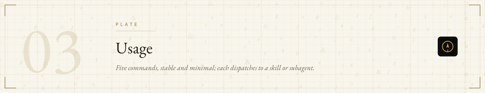
  </picture>
</p>

Once the plugin is loaded, the session-start hook greets you and lists the commands — in agents that ship the hook. Five commands, stable and minimal; each dispatches to a skill or subagent beneath it. In agents that do not register slash commands, invoke the same procedures in words — "Run the decision engine on `<decision>`" reaches the identical skill.

### Commands

<p align="center">
  <picture>
    <source media="(prefers-color-scheme: dark)" srcset=".github/assets/art-commands.svg">
    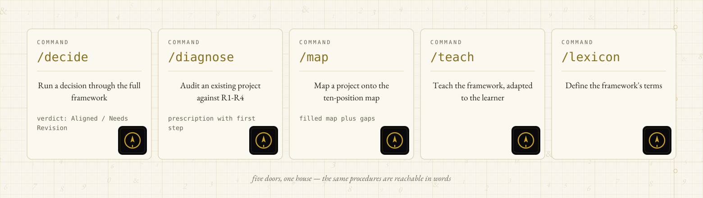
  </picture>
</p>

| Command       | Does                                                              |
| ------------- | ----------------------------------------------------------------- |
| `/decide`     | Run a decision through the full framework → `Aligned` / `Needs Revision` verdict |
| `/diagnose`   | Audit an existing project against R1–R4 → prescription with first step |
| `/map`        | Map a project onto the ten-position map → filled table plus gaps  |
| `/teach`      | Teach the framework, adapted to the learner                       |
| `/lexicon`    | Define the framework's terms                                      |

### Example

```text
/decide Ship the dashboard with the dark header instead of the light one
/diagnose the landing page from last quarter — it feels cold
/map the mobile app redesign
/teach a designer who has never used a decisioning framework
/lexicon emotional invariant
```

### Output format

The decision engine returns a structured verdict, in this fixed format:

```text
DECISION: <restated in one line>
GOAL: <under five words>

LOOP
  WHY   — <...>
  WHO   — <...>
  FEEL  — <...>
  EVOKE — <...>

PRINCIPLES
  R1 Recursive Grounding  [Pass/Weak/Fail] — <evidence>
  R2 Emotion as Invariant [Pass/Weak/Fail] — <evidence>
  R3 Distinction in Unity [Pass/Weak/Fail] — <evidence>
  R4 Scale the Invariance [Pass/Weak/Fail] — <evidence>

MATH: <the pattern found>

VERDICT: Aligned  |  Needs Revision
  <if Needs Revision: name the failing principle(s) and the single first move>
```

The verdict is binary at the top level; failures are named by principle, and the framework never softens a Fail into a Weak to reach Aligned. If you want a verdict instead of a discussion, this is the point.

<a name="plate-04" id="plate-04"></a>
<p align="center">
  <picture>
    <source media="(prefers-color-scheme: dark)" srcset=".github/assets/plate-04.svg">
    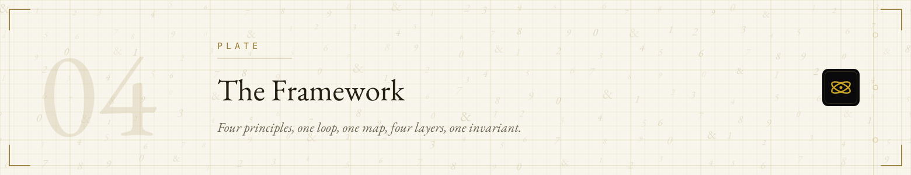
  </picture>
</p>

The framework is the content; the plugin is its encoding. It has five components — four principles, one loop, one map, four layers, one invariant.

### The four principles (R1–R4)

<p align="center">
  <picture>
    <source media="(prefers-color-scheme: dark)" srcset=".github/assets/art-pillars.svg">
    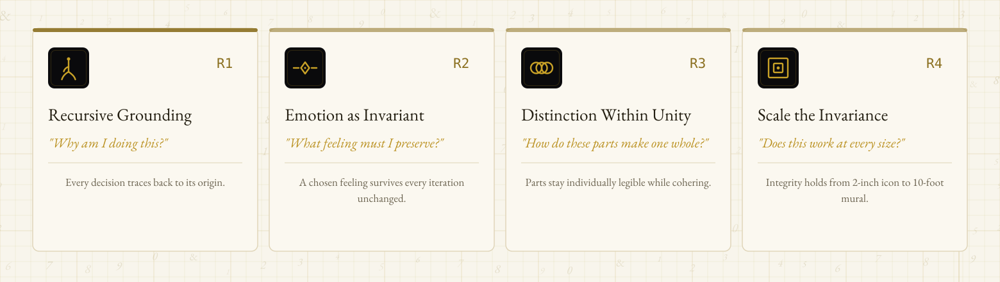
  </picture>
</p>

<details open>
<summary><strong>As a table</strong> (screen-reader / copy-friendly)</summary>

| Principle                     | Question                             | What it enforces                                    |
| ----------------------------- | ------------------------------------ | --------------------------------------------------- |
| **R1 · Recursive Grounding**  | "Why am I doing this?"               | Every decision traces back to its origin.           |
| **R2 · Emotion as Invariant** | "What feeling must I preserve?"      | A chosen feeling survives every iteration unchanged.|
| **R3 · Distinction Within Unity** | "How do these parts make one whole?" | Parts stay individually legible while cohering — "distinct colors, one shape." |
| **R4 · Scale the Invariance** | "Does this work at every size?"      | Integrity holds from 2-inch icon to 10-foot mural.  |

</details>

### The decisioning loop

<p align="center">
  <picture>
    <source media="(prefers-color-scheme: dark)" srcset=".github/assets/art-loop.svg">
    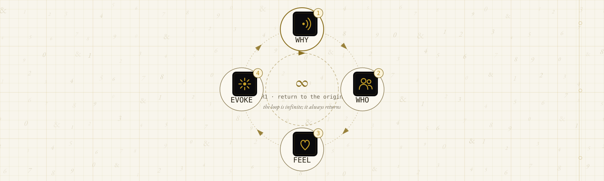
  </picture>
</p>

- **WHY** — the reason this exists
- **WHO** — who it is for, who receives it
- **FEEL** — the feeling that must be preserved
- **EVOKE** — how that feeling is produced

The loop is infinite; it always returns to the beginning. This is R1 in motion — no decision is ever fully grounded, only re-grounded each time you run the loop.

### The ten-position map

A second lens on the same structure. The loop is the sequence you run; the map is the shape it makes.

<p align="center">
  <picture>
    <source media="(prefers-color-scheme: dark)" srcset=".github/assets/art-map.svg">
    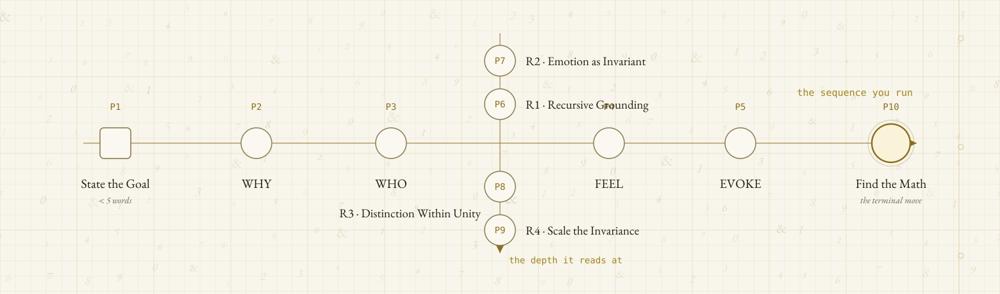
  </picture>
</p>

<details>
<summary><strong>As a table</strong></summary>

| Position | Element                |
| -------- | ---------------------- |
| 1        | State the Goal (< 5 words) |
| 2        | WHY                    |
| 3        | WHO                    |
| 4        | FEEL                   |
| 5        | EVOKE                  |
| 6        | R1 · Recursive Grounding |
| 7        | R2 · Emotion as Invariant |
| 8        | R3 · Distinction Within Unity |
| 9        | R4 · Scale the Invariance |
| 10       | Find the Math          |

</details>

Position 10 — **Find the Math** — is the terminal move: name the pattern, ratio, symmetry, or structure underneath the decision. If none exists, that absence is itself a finding. This is the move most decision frameworks do not have; it is the claim that good decisions have an underlying form, and that naming it makes a decision more legible and more transferable.

### The four layers

<p align="center">
  <picture>
    <source media="(prefers-color-scheme: dark)" srcset=".github/assets/art-layers.svg">
    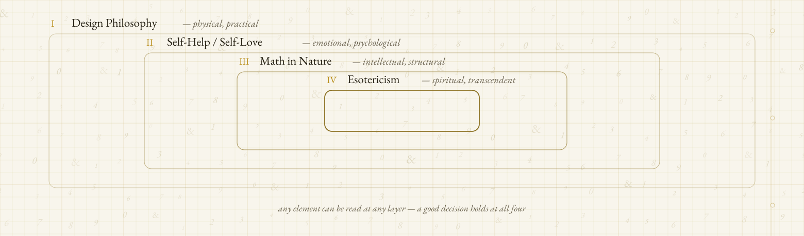
  </picture>
</p>

Any element can be read at any layer; a good decision holds at all four. (See [Background](#plate-01).)

### The invariant: WONDER

<p align="center">
  <picture>
    <source media="(prefers-color-scheme: dark)" srcset=".github/assets/art-wonder.svg">
    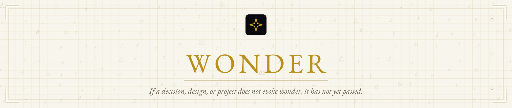
  </picture>
</p>

> [!TIP]
> **WONDER.** If a decision, design, or project does not evoke wonder, it has not passed. This is what R2 preserves and R4 scales — the single test the whole framework resolves to.

The invariant is the page's visual anchor: it appears as the closing mark of the [banner](#), returns as the anchor of Plate 06 below, and is the mark every verdict resolves against (see [the verdict table](#the-verdict-table)).

<p align="center">
  <picture>
    <source media="(prefers-color-scheme: dark)" srcset=".github/assets/divider.svg">
    
  </picture>
</p>

<a name="plate-05" id="plate-05"></a>
<p align="center">
  <picture>
    <source media="(prefers-color-scheme: dark)" srcset=".github/assets/plate-05.svg">
    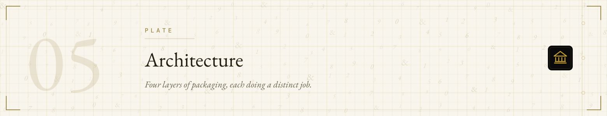
  </picture>
</p>

The plugin has four layers, and each does a distinct job — plus a packaging split that keeps it portable. This is also a plugin-authoring reference: it is a complete worked example of an Agent Plugins 1.0.0 package with client namespaces cooperating in one repository.

### Portability — the packaging split

Two kinds of content live side by side, per the Agent Plugins 1.0.0 standard (§8, client extensions):

<p align="center">
  <picture>
    <source media="(prefers-color-scheme: dark)" srcset=".github/assets/art-architecture.svg">
    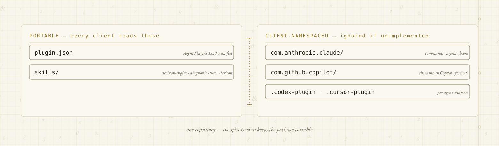
  </picture>
</p>

- **Portable** — [`skills/`](skills) and the root [`plugin.json`](plugin.json). Every Agent Plugins 1.0.0 client reads these; they reference nothing client-specific.
- **Client-namespaced** — [`com.anthropic.claude/`](com.anthropic.claude) (commands, subagents, hooks, hook scripts) and [`com.github.copilot/`](com.github.copilot) (the same components in Copilot's documented formats, with a [porting note](com.github.copilot/README.md)). Clients that don't implement a namespace ignore it, which is what keeps the package portable.

  Claude Code's manifest at [`.claude-plugin/plugin.json`](.claude-plugin/plugin.json) declares the namespace paths for its commands, agents, and hooks.

Per-agent adapters live in [`.codex-plugin/plugin.json`](.codex-plugin/plugin.json) (Codex compatibility fallback) and [`.cursor-plugin/plugin.json`](.cursor-plugin/plugin.json) (Cursor manifest pointing at the portable skills and the Claude-namespace commands and agents).

### Commands — the public entry points

Five flat command files in [`com.anthropic.claude/commands/`](com.anthropic.claude/commands) — `decide.md`, `diagnose.md`, `map.md`, `teach.md`, `lexicon.md`. Commands are thin: an argument hint, a one-line description, and dispatch instructions. Depth lives below them. Copilot users get the same five doors as command wrappers under [`com.github.copilot/commands/`](com.github.copilot/commands).

### Skills — the operative content

Four skills in [`skills/`](skills), each a `SKILL.md` carrying the compact canon it needs:

| Skill              | Carries                                                              |
| ------------------ | -------------------------------------------------------------------- |
| `decision-engine`  | Principles, loop, and the structured output format (backs `/decide`)  |
| `diagnostic`       | The audit process: where an existing work loses the invariant (backs `/diagnose`) |
| `tutor`            | The canon plus a teaching structure and level-adaptation rules (backs `/teach`) |
| `lexicon`          | The canon plus the full glossary (backs `/lexicon`)                   |

Every skill carries the invariant.

### Subagents — the specialists

Three subagents in [`com.anthropic.claude/agents/`](com.anthropic.claude/agents), all `model: sonnet`, all with `disallowedTools: Write, Edit` — they evaluate, they do not modify.

| Agent                  | Job                                            | Effort | Turns |
| ---------------------- | ---------------------------------------------- | ------ | ----- |
| `gregorian-decision`   | The full framework run → structured verdict    | medium | 15    |
| `invariant-checker`    | The fast narrow pass → `Preserved` / `Lost`    | low    | 8     |
| `ten-position-mapper`  | Structural cartography → map plus gaps         | medium | 12    |

The division of labor is clean: `gregorian-decision` is the full operation, `invariant-checker` is the scalpel, `ten-position-mapper` does the cartography.

Copilot users get the same three specialists as `.agent.md` custom agents under [`com.github.copilot/agents/`](com.github.copilot/agents); the no-write guardrail travels in the prompt body there, since `.agent.md` frontmatter does not carry `disallowedTools`.

### Hooks — the ambient reminders

Two hooks in [`com.anthropic.claude/hooks/hooks.json`](com.anthropic.claude/hooks/hooks.json), both non-blocking:

- **SessionStart** runs [`com.anthropic.claude/scripts/welcome.sh`](com.anthropic.claude/scripts/welcome.sh), which greets you and lists the commands.
- **PreToolUse** on `Write|Edit` runs [`com.anthropic.claude/scripts/design-reminder.sh`](com.anthropic.claude/scripts/design-reminder.sh), which fires only when the file being touched matches `*.design.md` and reminds you to check the invariant (R2) and scale (R4). It exits 0 — it reminds, it does not gate.

The hook commands reference `${CLAUDE_PLUGIN_ROOT}` — the plugin root — so the scripts resolve through the namespace path (`com.anthropic.claude/scripts/`) and nothing escapes the plugin directory.

Hooks are Claude-namespace components; agents without a hook mechanism simply run without them.

### Canon and synchronization

> [!WARNING]
> **Edit the canon in [CLAUDE.md](CLAUDE.md) first, then reconcile every skill in [`skills/`](skills) against it.**

[`CLAUDE.md`](CLAUDE.md) at the plugin root is the human-readable single source of truth for the framework — and, as the file states explicitly, it is *not* auto-loaded into the host agent's context.

The operative content is carried into context by the skills, each of which restates only the compact canon it needs. This is a deliberate synchronization burden accepted in exchange for skills that work standalone.

<p align="center">
  <picture>
    <source media="(prefers-color-scheme: dark)" srcset=".github/assets/divider.svg">
    
  </picture>
</p>

<a name="plate-06" id="plate-06"></a>
<p align="center">
  <picture>
    <source media="(prefers-color-scheme: dark)" srcset=".github/assets/plate-06.svg">
    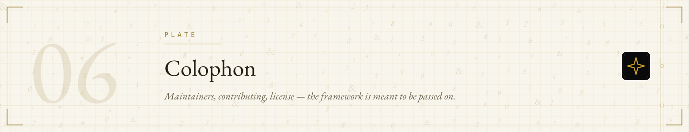
  </picture>
</p>

### Maintainers

- [@AlastairZeved](https://github.com/AlastairZeved) — author and maintainer.

### Contributing

Questions and framework discussion: [open an issue](https://github.com/AlastairZeved/With-Love-Math/issues). Pull requests are welcome for corrections and reconciliations; proposals that change the framework itself should be opened as issues first, since the framework is the content of the plugin.

| The one non-negotiable | The reason |
|---|---|
| **Edit the canon in [CLAUDE.md](CLAUDE.md) first, then reconcile every skill in [`skills/`](skills) against it.** | The skills each carry their own copy of the canon by design; a change that updates one copy but not the others breaks the synchronization rule the plugin runs on. Subagents under [`com.anthropic.claude/agents/`](com.anthropic.claude/agents) must keep `Write` and `Edit` disallowed — they evaluate, they do not modify. |

When adding a client-namespaced component, add it to the owning namespace (`com.anthropic.claude/` for Claude Code, `com.github.copilot/` for Copilot), declare it in that client's manifest where the client supports it, and keep the portable `skills/` directory client-agnostic.

Per-agent adapters live in [`.codex-plugin/plugin.json`](.codex-plugin/plugin.json) (Codex compatibility fallback) and [`.cursor-plugin/plugin.json`](.cursor-plugin/plugin.json) (Cursor) — update them when the portable surface they reference changes.

### License

[MIT](LICENSE) © AlastairZeved

## Design notes

This page is one continuous object: seven numbered plates on a single ground, the invariant as the recurring anchor.

- **The ground.** One seamless motif carries the whole page — warm graph paper (a 24-unit minor grid, a 120-unit major grid, a punch-holed margin rule) over a faint field of EB Garamond italics: ampersands and the digits of the ten positions. "Love letter meets mathematics" as a texture, not a decoration. The motif is defined once per theme in `.github/assets/textures/` (`ground-dark.svg`, `ground-light.svg`) and inherited by every chapter plate and diagram; it extends the banner's Deep Surfaces aesthetic (near-black field, faint glyph field, gold rules) down the page instead of restarting the design at section one.
- **Chapter system.** Seven plates, numbered 00–06, all on the one continuous ground — no section restarts the design. Each plate: a ghost chapter numeral, a `PLATE` label with rule, a serif display title in EB Garamond, an italic keyline restating the chapter's thesis, and a ribbon icon at the right edge, so a mid-page reader re-orients from the plate number and icon alone.
- **The icon family.** One system: 48-unit grid, 2.4-unit stroke, round caps and joins, gold on near-black. Every visual cue on the page comes from it — the inventory with the design rules lives in [docs/icons.md](docs/icons.md).
- **Diagrams, not prose.** The WHY→WHO→FEEL→EVOKE loop is a cycle diagram (`art-loop`), the ten positions are a two-axis map (`art-map`), R1–R4 are four parallel callouts (`art-pillars`), the drift of a decision from its origin is drawn (`art-drift`), and the install routes are a hallway of doors (`art-doors`). Tables remain as accessible fallbacks inside collapsible sections.
- **The spatial test.** Each plate is a room: the showcase is a screening room, the install section a hallway of doors, the framework a gallery with the four principles as framed callouts, the map a two-axis chart, the WONDER plate a lantern-lit inner chamber at the center of the house, and the colophon the door left open behind you. The question — *would this exist in a physical version of this space?* — was applied to every section; anything that could not be answered with a spatial object was reworked into one.
- **Constraints.** Static SVG/CSS only; zero new runtime dependencies; presentation restyle only — meaning is frozen.

<p align="center">
  <picture>
    <source media="(prefers-color-scheme: dark)" srcset=".github/assets/divider.svg">
    
  </picture>
</p>

<p align="center">
  <sub><strong>github.com/alastairzeved/with-love-math</strong> — *With Love, Math.*<br>
  <em>The framework is meant to be passed on.</em></sub>
</p>